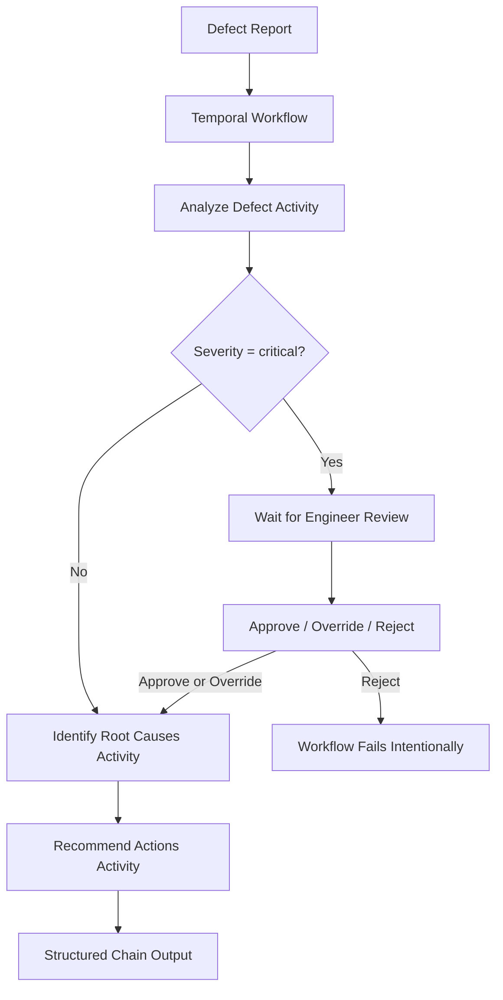

# Human-in-the-loop Agent with Temporal

This example is framed around **manufacturing quality control**:

1. Analyze a defect report
2. Identify likely root causes
3. Recommend corrective actions
4. Pause for engineer review if severity is `critical`

## Architecture



## Tech Stack

- Python
- Temporal Python SDK
- Pydantic
- `pydantic-ai`
- OpenAI models

## Project Structure

- `workflows.py` - Durable Temporal workflow orchestration
- `activities.py` - LLM-backed activity implementations
- `agents.py` - Agent and model configuration
- `prompts.py` - System prompts for each step in the chain
- `models.py` - Pydantic input/output schemas
- `worker.py` - Temporal worker entrypoint
- `starter.py` - Starts a sample workflow execution
- `reviewer.py` - Sends engineer review decisions back to the workflow

## Workflow Behavior

The workflow executes three sequential steps:

1. **Defect Analysis**
   Classifies severity, defect category, affected components, and summary.

2. **Root Cause Analysis**
   Produces likely root causes, contributing factors, and confidence.

3. **Corrective Action Planning**
   Recommends concrete actions with priorities and responsible departments.

If the defect severity is `critical`, the workflow pauses and waits for a human engineer to review the result before continuing.

## Human-in-the-Loop Review

When a workflow is waiting for review, an engineer can:

- `approve` - Continue the chain as-is
- `override` - Adjust severity or category, then continue
- `reject` - Stop the workflow

This is implemented using:

- a workflow **query** to check whether review is needed
- a workflow **signal** to submit the final decision

That means the review step is durable and survives worker restarts.

## Getting Started

### Prerequisites

- Python 3.10+
- A running Temporal server
- An OpenAI API key

### 1. Install dependencies

```bash
python -m venv .venv
source .venv/bin/activate
pip install -r requirements.txt
```

On Windows PowerShell:

```powershell
python -m venv .venv
.venv\Scripts\Activate.ps1
pip install -r requirements.txt
```

### 2. Create a `.env` file

```env
OPENAI_API_KEY=your_openai_api_key
OPENAI_MODEL=gpt-5.4-nano
OPENAI_TIMEOUT_SECONDS=30
```

### 3. Start Temporal locally

If you have the Temporal CLI installed:

```bash
temporal server start-dev
```

This project expects Temporal at:

- `localhost:7233`

### 4. Start the worker

```bash
python worker.py
```

### 5. Start the sample workflow

```bash
python starter.py
```

### 6. Review the workflow if it pauses

If the defect is classified as critical, run:

```bash
python reviewer.py
```

## Example Flow

`starter.py` submits a sample defect report for product `PUMP-4421`.

If the first activity returns `critical` severity:

- the workflow pauses for up to 24 hours
- `reviewer.py` can approve, override, or reject the result
- the workflow then resumes from the exact paused point


## Customization Ideas

You can adapt this project by changing:

- `prompts.py` to use a different domain or reasoning style
- `models.py` to capture a different structured output
- `starter.py` to submit real business inputs
- `reviewer.py` to connect review decisions to a UI or internal tool
- `agents.py` to swap models or provider settings

## Why Temporal for a Prompt Chain?

A normal script can run a prompt chain. Temporal makes it **operationally safe**.

With Temporal, this pattern becomes:

- restart-safe
- observable
- retryable
- resumable after human input
- easier to extend with approvals, timeouts, and additional steps

## Notes

- The sample workflow ID in `reviewer.py` must match the workflow started by `starter.py`
- The current task queue is `prompt-chain-queue`
- This repo is a pattern demo, not a production-ready manufacturing systm
